# Staffingbetit - Complete User Manual

Welcome to the Staffingbetit Attendance Management System. This manual provides a complete walkthrough for both **Employees** and **Administrators** on how to effectively use the platform.

---

## 🔐 1. Login Process
Both Employees and Admins access the system through the main login portal. 

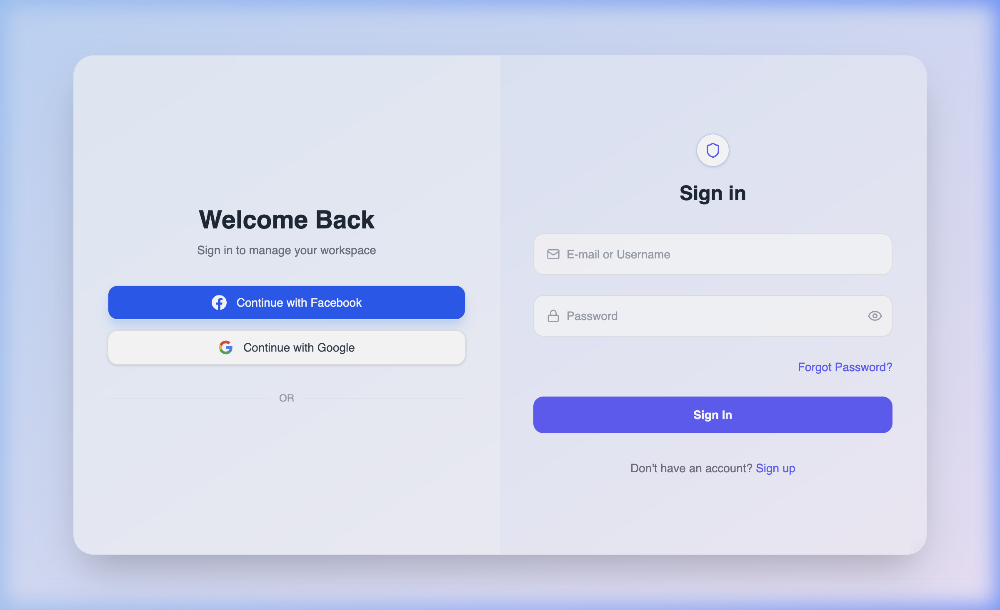

### Employee Credentials
- **Email:** `test@test.com`
- **Password:** `test123`

### Administrator Credentials
- **Email:** `admin@admin.com`
- **Password:** `admin123`

---

## 👨‍💼 2. Employee Portal

### The Employee Dashboard
Upon logging in, employees are greeted by the Dashboard. This is your central hub for time tracking and performance analytics.

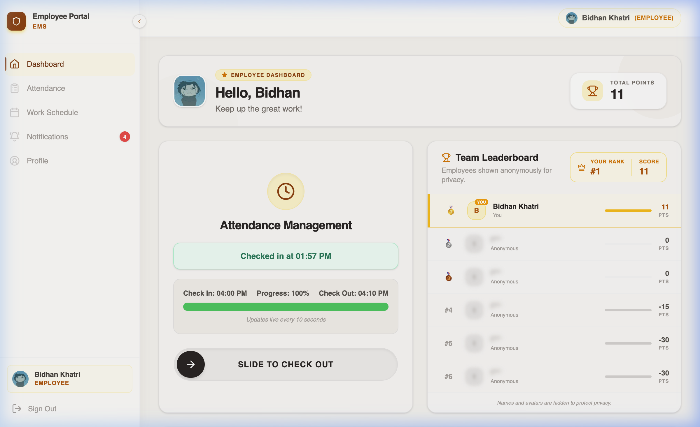

**Key Features:**
- **Attendance Management:** Use the interactive slider to Check In when your shift starts, and Check Out when you leave. 
- **Today's Snapshot:** A quick view of your current status (e.g., On Time, Late), check-in/out times, and points awarded for the day.
- **Team Leaderboard:** See how you rank against your peers in points! (Note: Other employees are anonymized to protect privacy).
- **Performance Analytics:** A visual graph of your point accumulation over the week, month, or year.

### Attendance History
Keep track of all your past check-ins and shifts.

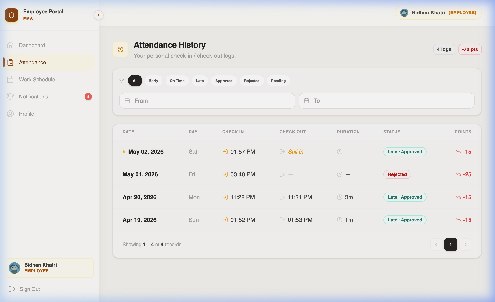

- **Filters:** Easily filter your history by Status (On-Time, Late, Early) or date ranges.
- **Points:** Review exactly how many points you earned or lost on any given day.

### Work Schedule
View your upcoming shifts and assigned working hours.

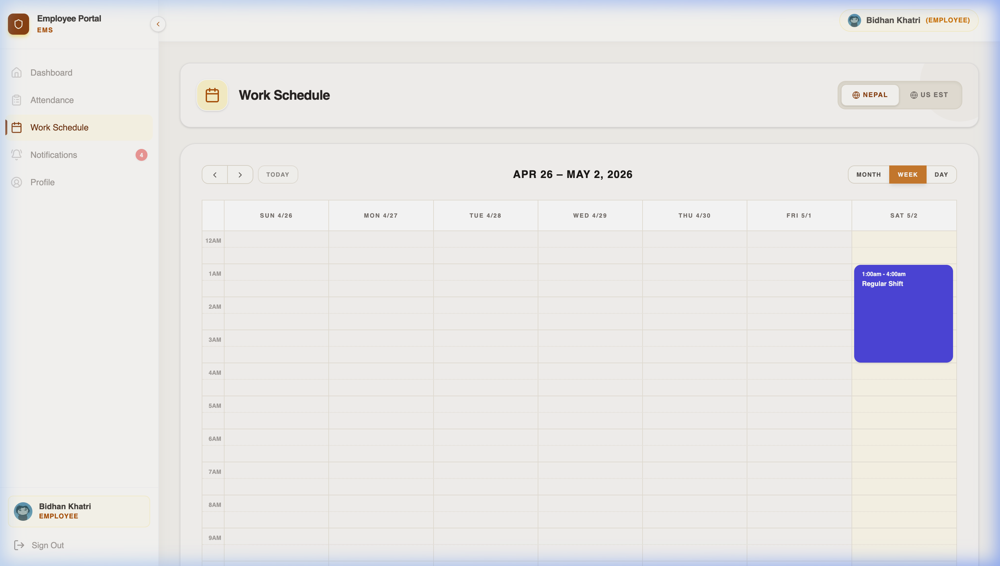

- **Shift Details:** See your start and end times for any scheduled day.
- **Monthly Overview:** Plan your month with a clear calendar layout.

### Notifications
Stay updated on important system alerts and approval statuses.

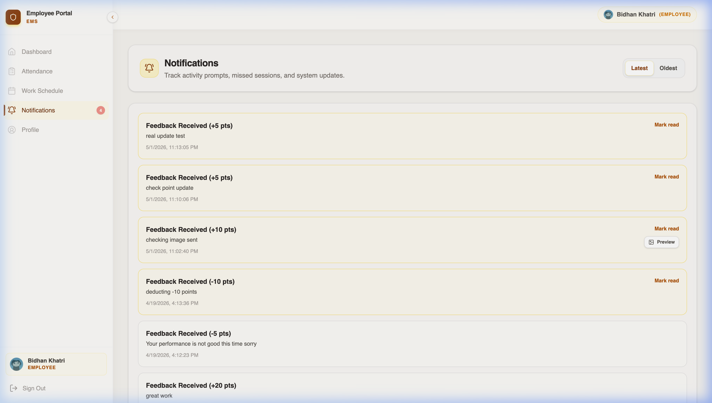

- **Alerts:** Receive notifications when your late check-in is approved or rejected, or when new shifts are assigned.

### Profile
Manage your personal information and account security.

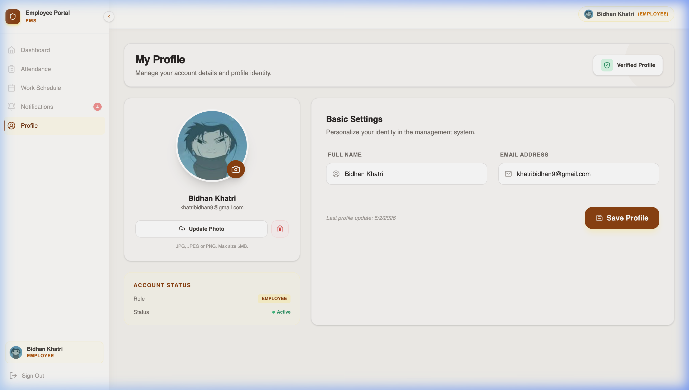

- **Personal Details:** Update your name, email, and profile picture.
- **Security:** Change your password or update your contact preferences.

---

## 👑 3. Administrator Portal

### The Admin Dashboard
Admins have access to a comprehensive overview of the entire workforce's metrics.

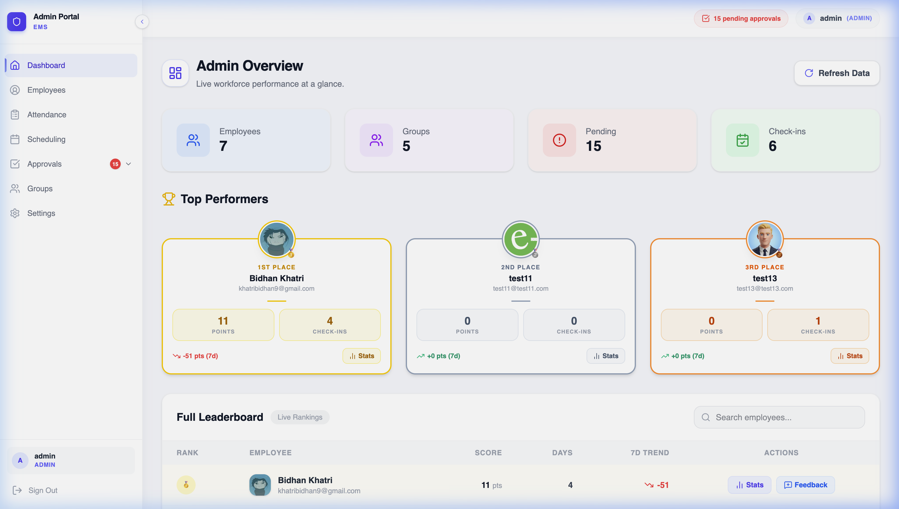

**Key Features:**
- **High-Level Stats:** Instantly view total employees, system alerts, and pending approvals.
- **Today's Overview:** Monitor how many employees are currently checked in or late.
- **Top Performers Podium:** A visual podium highlighting the top 3 employees with the highest performance scores.

### Approvals Hub
Manage employee exceptions smoothly.

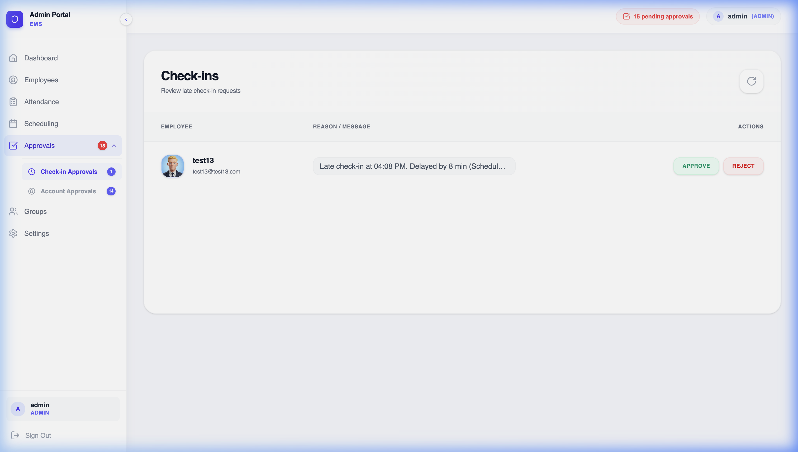

- **Late Check-Ins:** When employees check in late, it flags here for your review. You can **Approve** (with a remark) or **Reject** their late arrival.
- **Automated Emails:** The system will automatically notify the employee of your decision via email.

### Shift & Schedule Management
Control when your employees are expected to work.

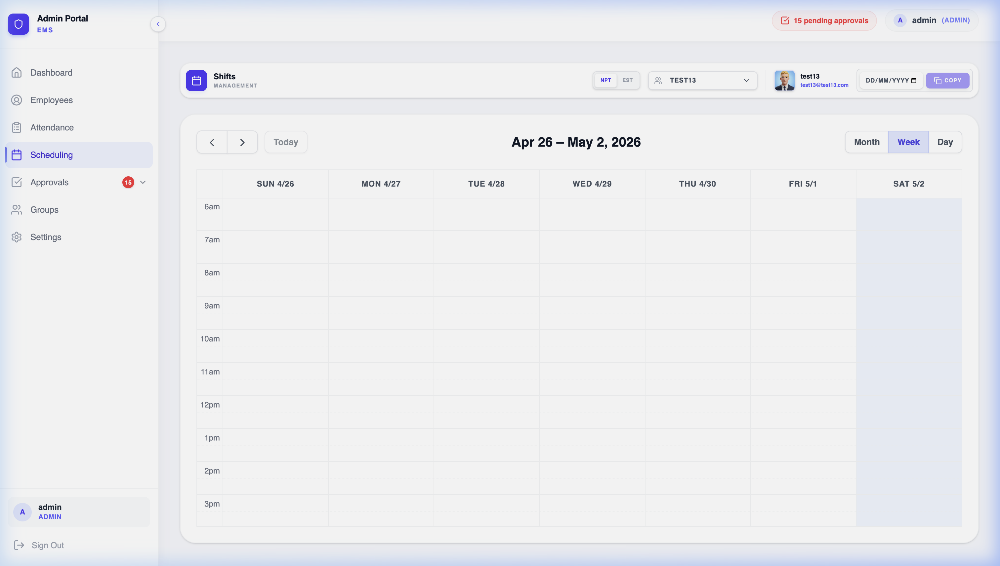

- **Interactive Calendar:** Click any day to assign a shift to an employee.
- **Drag & Drop:** Easily move shifts around if schedules change.
- **Timezone Support:** Manage shifts across different timezones effortlessly from the top toolbar.

### Employee Management
Oversee your entire workforce from a single centralized table.

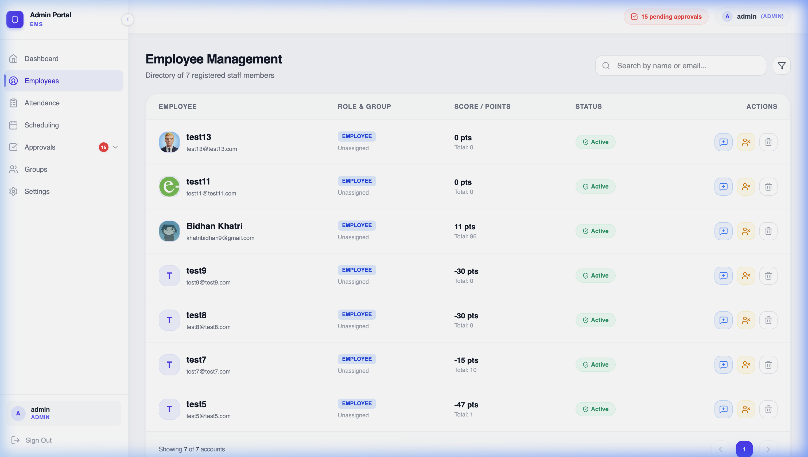

- **User Profiles:** View and manage detailed employee records.
- **Status Control:** Activate or deactivate employee accounts as needed.

### Groups & Departments
Organize your workforce into logical groups.

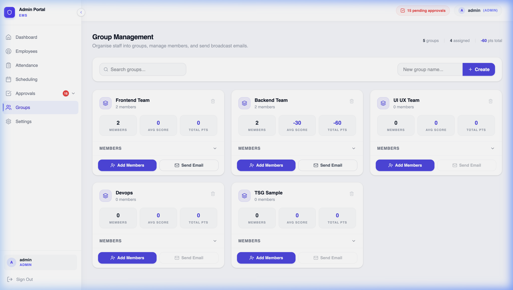

- **Team Management:** Create departments and assign employees to specific teams.
- **Targeted Scheduling:** Easily schedule shifts for entire groups at once.

### System Settings
Configure core rules and parameters for the attendance system.

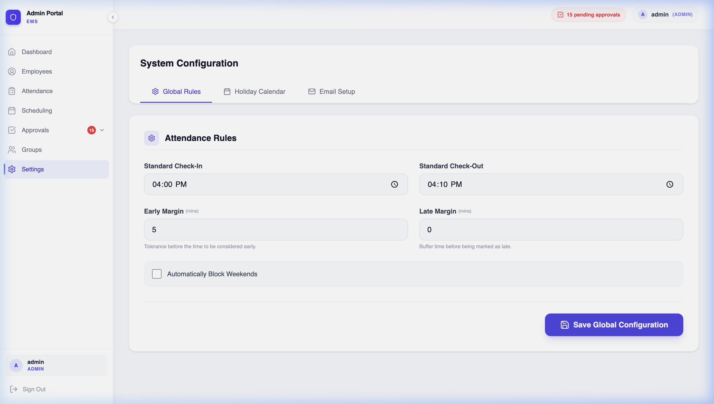

- **Attendance Rules:** Set the official Check-in and Check-out times.
- **Points System:** Define the points awarded or penalized for various attendance statuses.

---
*Staffingbetit - Built for modern workforce management.*
